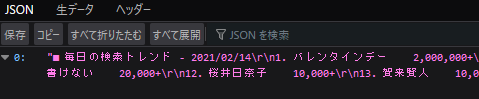
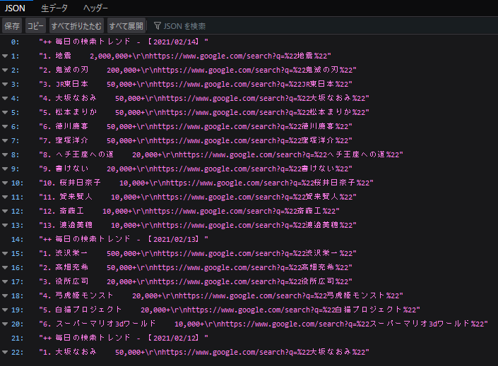

# GtrendsApi

+ ブラウザ

[https://gtrends-api-ss.herokuapp.com/](https://gtrends-api-ss.herokuapp.com/)

+ ターミナル

```
$ curl https://gtrends-api-ss.herokuapp.com/
```

# Release Note

+ Commit-Id : 0580aaf3a1cf4d3ce89764830962410a4205d4ac
  - 1要素にまとめた



+ Commit-Id : 6c25eb825d194ee7c082bf2f3ad199b50e1b8838
  - 検索用URL付きで返却


